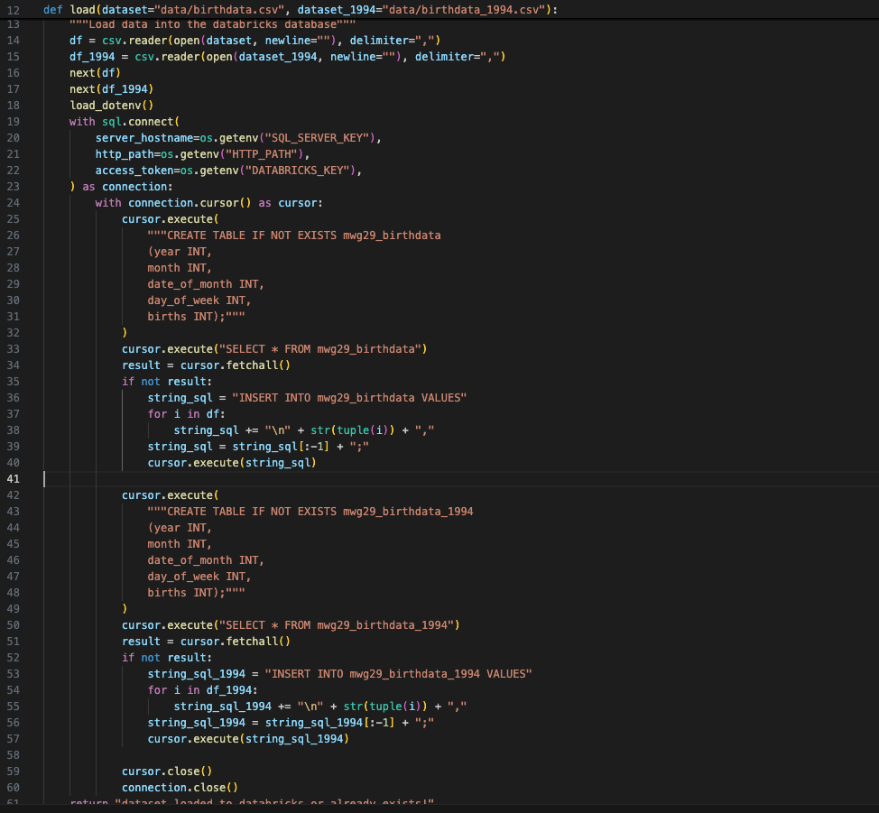
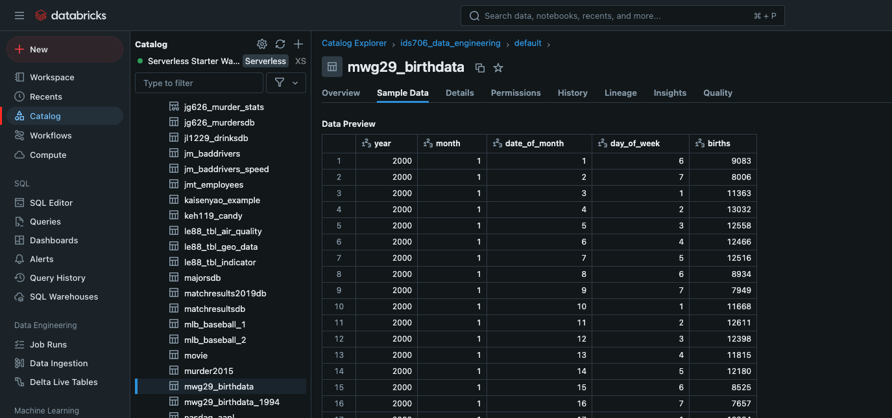
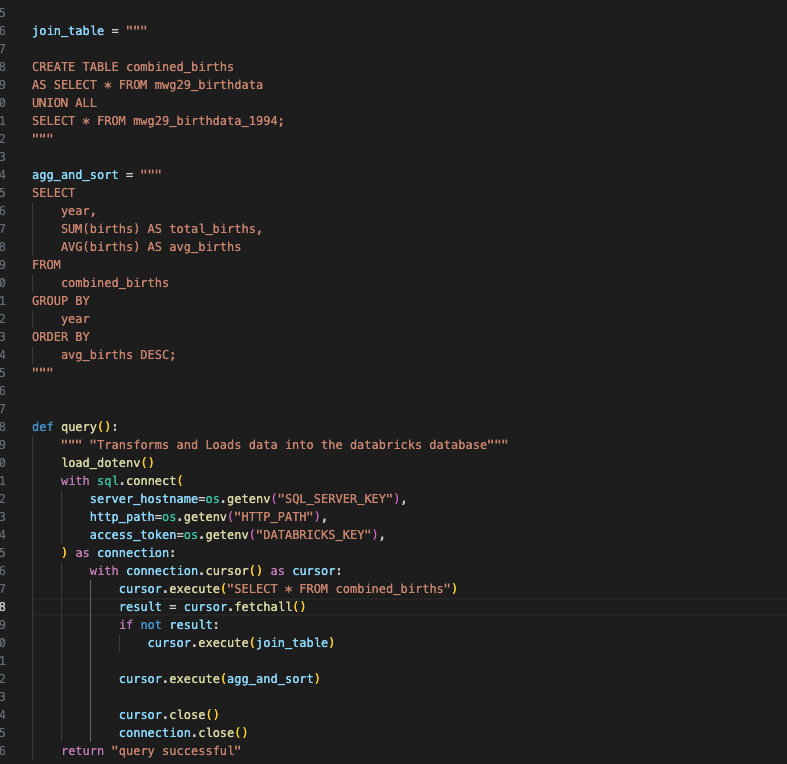
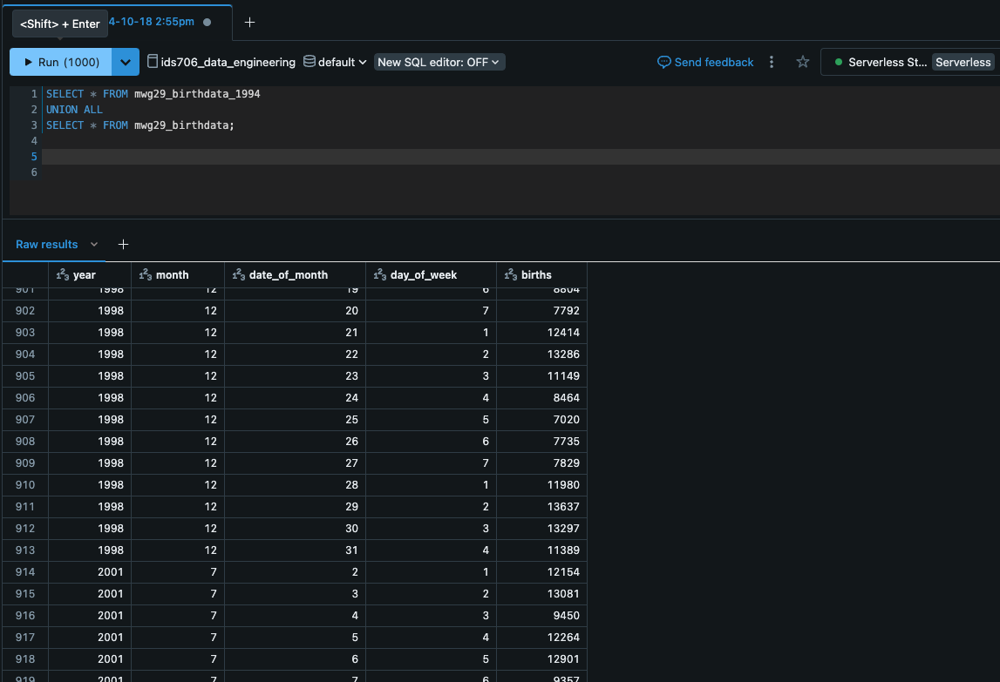

## Meron Gedrago mini project week 6

[](https://github.com/nogibjj/Meron_Gedrago_mini_Week6/actions/workflows/cicd.yml)

## Structure for this project 

```
├── .devcontainer/
│   ├── devcontainer.json
│   └── Dockerfile
├── .github/
│   └── workflows/
│        └──cicd.yml
├── .mylib/
│   ├── extract.py
│   ├── query.py
│   └── transform_load.py 
├── .gitignore
├── visuals
├── requirements.txt
├── Makefile
├── README.md
├── main.py
└── test_main.py

```
## Purpose of the project  

This project aims to connect to an external databse (I used Databricks) and perform complex SQL queries on [fivethirtyeight data](https://github.com/fivethirtyeight/data/tree/master/births). 
There are three main highlights in this project: Connecting to Databricks, Performing complex queries and Pushing to github 


### Connecting to external database: *connect to Databricks* 
**Code:**
Steps done in the code to connect to Databricks:
1. Set up sensitive login information in .env and reference it in the load function 
2. Connect to Databricks using the login information 
3. Create the first table if it doesnt already exists 
4. Check if the table has something in it, if it doesnt then fill out the table with values from out csv file 
5. Replicate for second table




**Tables in Databricks:**


### Performing complex queries: *Perform aggregation, joining of two tables and sorting*
**Code:**
Steps done in the code to perform complex queries:
1. Connect to Databricks 
2. Check if the combination of the two tables exist, if not, join the two tables by rows 
3. Using the combined tables, aggregate the births by year, add a column for summation and average of the birth and sort descending by average births per year 



**Combined tables in Databricks:**



### CI/CD: *Pushing to github successfully*

