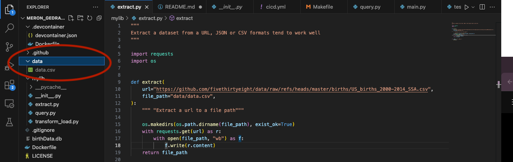
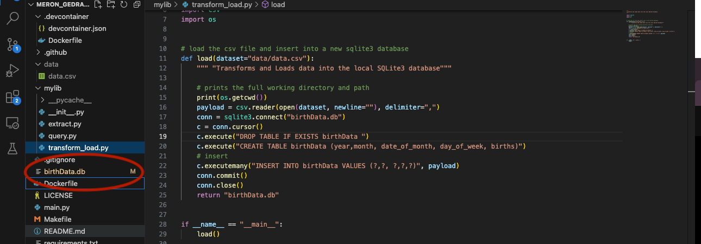
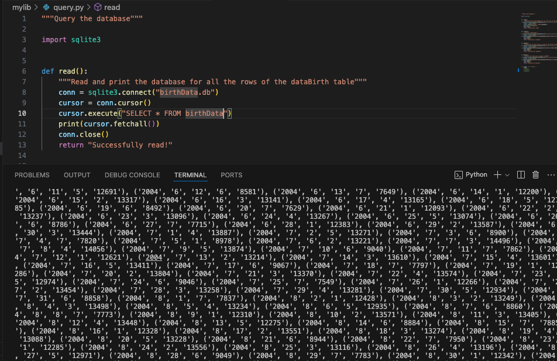
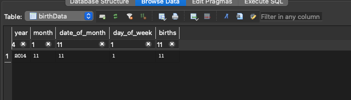
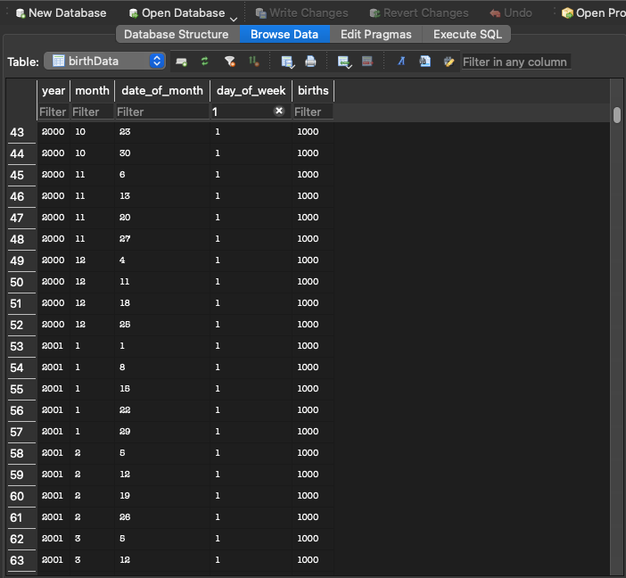
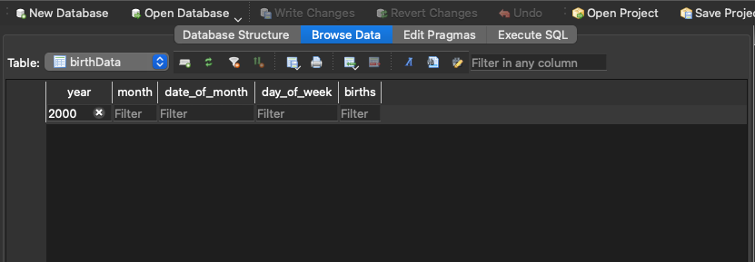

## Meron Gedrago mini project week 5

[](https://github.com/nogibjj/Meron_Gedrago_mini_Week5/actions/workflows/cicd.yml)

## Structure for this project 

```
├── .devcontainer/
│   ├── devcontainer.json
│   └── Dockerfile
├── .github/
│   └── workflows/
│        └──cicd.yml
├── .mylib/
│   ├── extract.py
│   ├── query.py
│   └── transform_load.py 
├── .gitignore
├── visuals
├── requirements.txt
├── Makefile
├── README.md
├── main.py
└── test_main.py

```
## Purpose of the project  

This project aims to create a basic ETL pipeline by connecting to SQLite and performing simple SQL queries on a [fivethirtyeight data](https://github.com/fivethirtyeight/data/tree/master/births) on births from 2000-2014 incuding the number of births reported everyday across the years
([E] Extract a dataset from URL, [T] Transform, [L] Load into SQLite Database and [Q] Query
For the ETL-Query lab) 


### [E] Extract: *extract a csv file from url and create file (data.csv) in local directory* 



### [T] Transform and [L] Load: *Transform the csv file into a db file and connect to SQLite*



### [Q] Query: *Perform CRUD (Create, Read, Update and Delete) operations*

#### Read - *reading and printing each of the rows in the dataset* 

**Code:**
```
cursor.execute("SELECT * FROM birthData")
print(cursor.fetchall())
```



#### Create - *Create a new row and add it to the table (the row is (2014,11,11,1,11))* 

**Code:**
```
cursor.execute("INSERT INTO birthData VALUES ('2014','11','11','1','11')")
```


#### Update - *Update rows based on a condition, changing the birth number to 1000 if day of week is 1* 

**Code:**
```
cursor.execute("UPDATE birthData SET births = '1000' WHERE day_of_week = '1';")
```




#### Delete - *Delete rows based on a condition, deleting rows where the birth year is 2000* 

**Code:**
```
cursor.execute("DELETE FROM birthData WHERE year = '2000';")
```


